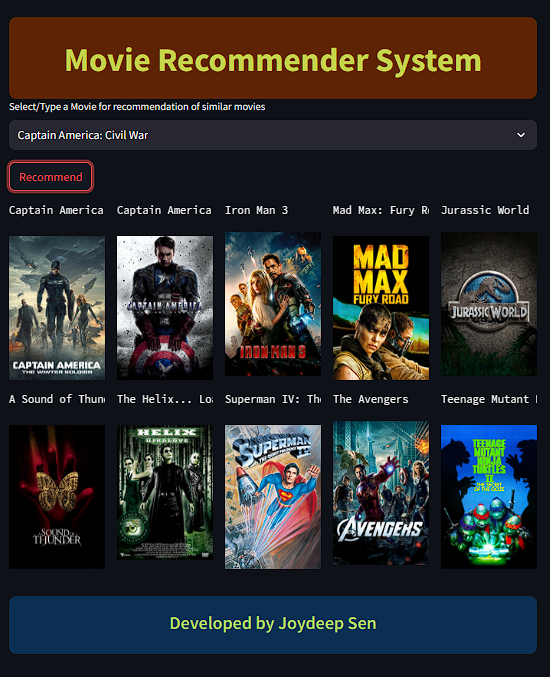
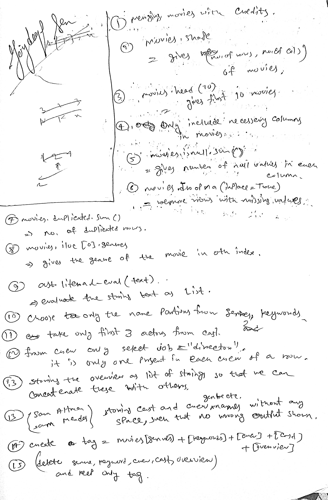
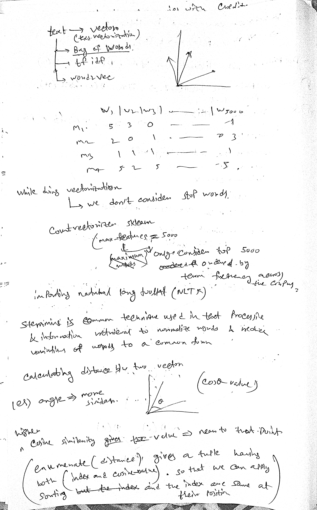
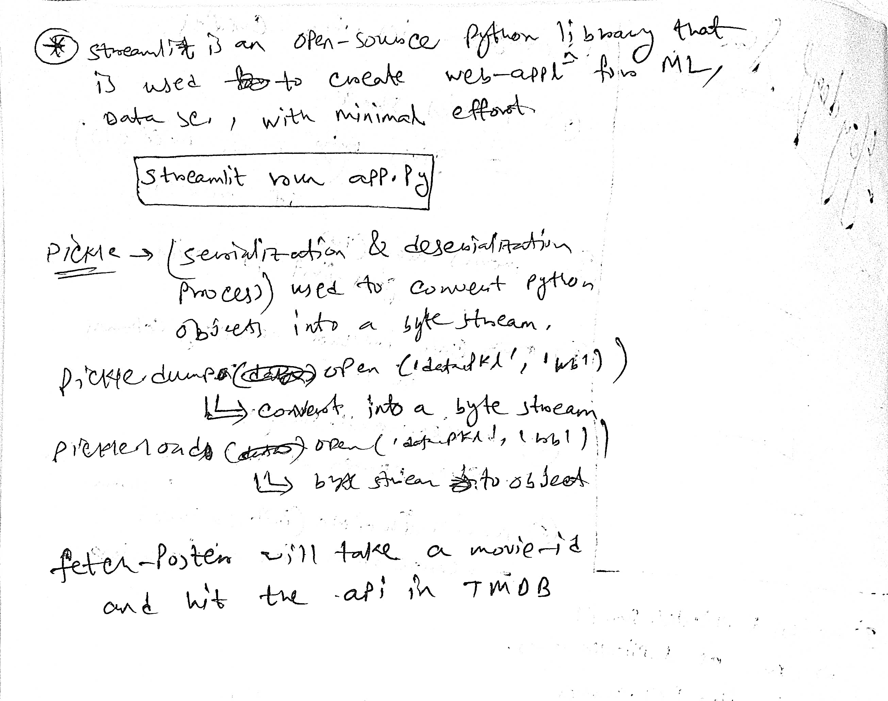

# Movie-Recommender-System-tmdb-dataset
A content based movie recommender system using cosine similarity
## TechStack: numpy , pandas , Streamlit
### Run app.py : streamlit run app.py
## Website 

## Details

